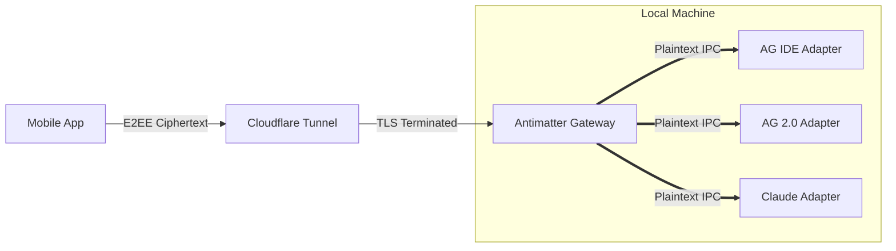

# Antimatter Ecosystem

[](https://f-droid.org/packages/dev.saifmukhtar.antimatter/)
[](https://github.com/sponsors/saifmukhtar)
[](https://antimatter.saifmukhtar.dev)
[](https://github.com/saifmukhtar/antimatter/stargazers)
[](https://opensource.org/licenses/MIT)
[](https://deepwiki.com/saifmukhtar/antimatter)

> [!IMPORTANT]
> ### 🚀 Antimatter has evolved into [Ultimate Antimatter](https://github.com/saifmukhtar/ultimate-antimatter)!
> 
> Instead of maintaining an emulated native Android app with limited features and ongoing maintenance overhead, **[Ultimate Antimatter](https://github.com/saifmukhtar/ultimate-antimatter)** serves the **real, 100% feature-complete desktop IDE directly to your mobile device**:
> 
> * **✨ 100% 1:1 Desktop Parity Out-of-the-Box:** Model switching, subagent visualizers, prompt previews, extensions, full settings, and terminals work natively with zero emulated UI bugs.
> * **📱 PWA Superpower (Add to Home Screen):** Open the bridge URL on Android or iOS (Chrome/Safari) and tap **"Add to Home Screen"** for an instant, full-screen standalone mobile app experience.
> * **⚡ Single Standalone Executable:** Zero Python/daemon dependencies, zero `pip` installations. Just run `./bin/antimatter` with an official desktop GUI control panel.
> * **🌍 Ultra-Fast Tailscale + Local TLS:** Direct P2P WireGuard (~20ms ping) + Local Wi-Fi HTTP/2 multiplexing with automated trusted TLS.
> 
> 👉 **Switch to the new repository:** [**github.com/saifmukhtar/ultimate-antimatter**](https://github.com/saifmukhtar/ultimate-antimatter)

> [!WARNING]
> **Community Project Disclaimer**
> Antimatter is an unofficial, community-driven, open-source project. It is **NOT** an official product of Google, Anthropic, or any AI provider.

**Antimatter** is the ultimate open-source bridge ecosystem that securely connects your mobile device directly to your local AI agents (Google Antigravity, Claude Code, and more).

By securely tunneling your phone to your local host machine, you can view your active AI agent's trajectory, monitor its thought process, read logs in real-time, send new prompts, and browse your workspace files—all from your mobile device.


---

## ⚡ The Independent Adapter Model

Antimatter is built on a massive architectural breakthrough: **The Independent Adapter Model**.



Instead of packing complex security and tunneling code into every single AI integration, Antimatter splits the ecosystem into two distinct layers, ensuring absolute stability and security.

### 1. The Gateway (`antimatter-gateway`)
The brain of the operation. This is a highly secure Python daemon that runs in the background. It manages **Cloudflare Tunnels**, generates 256-bit cryptographic keys, and handles the **Ed25519 Handshake** with your Android device. It hosts a secure local IPC router at `127.0.0.1:8765`.

### 2. The Adapters (`adapters/`)
Lightweight, "dumb" IPC clients that connect to the Gateway. Because they don't have to worry about security or networking, they are extremely modular and custom-built for specific AI environments.

We currently officially support:
- **[Antigravity IDE Adapter (`ag`)](https://antimatter.saifmukhtar.dev/adapters)** - A TypeScript VS Code extension.
- **[Antigravity 2.0 Adapter (`ag2`)](https://antimatter.saifmukhtar.dev/adapters)** - A standalone Python daemon.
- **[Claude Code Adapter (`cc`)](https://antimatter.saifmukhtar.dev/adapters)** - A Node.js streaming integration.

*Want to connect a brand new AI agent? Just write a simple WebSocket IPC script and connect it to the Gateway!*

---

## 🚀 Short Guide (TL;DR)

1. **Install Android App:** Download the latest APK from [GitHub Releases](https://github.com/saifmukhtar/antimatter/releases) (F-Droid is currently outdated).
2. **Install Gateway:** `pip install antimatter-gateway` (or use `uv`).
3. **Start & Pair:** Run `antimatter-gateway start` (choose LAN/Cloudflare/Both). Then run `antimatter-gateway pair` (choose LAN/Cloudflare) and scan the QR code with your phone. *Your workspace is now securely accessible!*
4. **Run Adapters:** 
   - **Antigravity IDE (`ag`)**: Install `antimatter-ag` from OpenVSIX, start it from the IDE.
   - **Antigravity 2.0 (`ag2`)**: `pip install antimatter-ag2`, run `antimatter-ag2 init` (once), then `antimatter-ag2 start` (daemon) or `antimatter-ag2 run_server`.

> Note: Claude Code (`cc`) support is currently experimental and not fully working.

---

## 📖 Long Guide

Getting started is simple, but it is important to understand the flow: you connect your phone to the **Gateway** first, and then you start the **Adapters** for your AI agents. You can run multiple adapters at the same time and switch between them seamlessly on your phone. If an adapter crashes, your phone's connection to the Gateway remains fully intact!

### 1. Install the Android App
Currently, the latest versions are only available via GitHub. Download the latest APK from our [GitHub Releases](https://github.com/saifmukhtar/antimatter/releases) and install it on your Android device.

### 2. Install the Gateway
Install the core infrastructure using `pip` or `uv`:
```bash
pip install antimatter-gateway
```

### 3. Start the Gateway
```bash
antimatter-gateway start
```
*Upon starting, you will be prompted to choose your connection mode: (1) LAN, (2) Cloudflare, or Both. Once selected, the gateway will start.*

### 4. Pair Your Phone
1. In a new terminal window, type `antimatter-gateway pair` to generate a secure QR code.
2. *You will be prompted to choose which connection method to pair with (LAN or Cloudflare).*
3. Scan the generated QR code with the app. 

You are now cryptographically paired! Even without any AI agents running, you can now instantly browse your workspace files from your phone.

### 5. Install & Start Your Adapters

Now you can attach your AI agents. The Gateway will automatically detect them.

**For Antigravity IDE (`ag`)**
This is the recommended experience. Install the `antimatter-ag` extension via OpenVSIX. Once installed, start it directly from your IDE. It will automatically connect to your running Gateway.

**For Antigravity 2.0 (`ag2`)**
Install the Python daemon:
```bash
pip install antimatter-ag2
antimatter-ag2 init
```
*(The `init` command only needs to be run once).*
Then, start the adapter:
```bash
antimatter-ag2 start       # Runs in the background
# OR
antimatter-ag2 run_server  # Runs in the foreground
```

> [!WARNING]
> **Claude Code (`cc`) adapter** is currently under heavy development and may not function fully.

> [!WARNING]
> **Connection Mode Selection**
> Antimatter does not save your connection preference. You can dynamically choose between Local Network (LAN) and Cloudflare Tunnel on every `start` and `pair` command, without modifying any configuration files. When connecting over LAN, the app relies on robust Application-Layer E2EE rather than TLS, maintaining full security without requiring manual certificate installation.

> [!TIP]
> **Troubleshooting LAN Connections (Firewalls)**
> If you selected LAN mode but the Android app fails to connect, your host machine's firewall is likely dropping the incoming packets on port `8765`. To fix this, you must explicitly allow port 8765/tcp through your local firewall:
> - **Ubuntu / Debian (UFW):** `sudo ufw allow 8765/tcp`
> - **Fedora / RHEL (Firewalld):** `sudo firewall-cmd --add-port=8765/tcp --permanent && sudo firewall-cmd --reload`
> 
> *Alternatively, use Cloudflare Mode which bypasses local firewalls by creating an outbound tunnel.*

---

## 📖 Official Documentation

**We have a dedicated documentation website!**  
👉 **[Read the Official Antimatter Documentation Here](https://antimatter.saifmukhtar.dev)**

Explore the depths of the ecosystem:

**Getting Started**
- [**Installation & Setup**](https://antimatter.saifmukhtar.dev/getting-started) - End-to-end quickstart.
- [**Features Breakdown**](https://antimatter.saifmukhtar.dev) - A detailed list of everything Antimatter can do.

**Architecture & Security**
- [**Architecture Deep Dive**](https://antimatter.saifmukhtar.dev/architecture) - Learn exactly how the Gateway routes IPC payloads.
- [**Security Policy**](https://antimatter.saifmukhtar.dev/security) - Read about our Biometric locks, Cryptographic Handshakes, and sandboxing.
- [**Zero Trust Guide**](https://antimatter.saifmukhtar.dev/security) - Add a secondary enterprise authentication layer with Cloudflare Access.

**Reference**
- [**WebSocket Protocol**](https://antimatter.saifmukhtar.dev/protocol) - The complete message contract between the Gateway and the app.
- [**Android App**](https://antimatter.saifmukhtar.dev/android) - Learn how the Jetpack Compose app dynamically selects active adapters.

---

## ✨ Core Features

- **Real-Time Streaming**: Watch your agent's thought process character-by-character.
- **Zero Trust Security**: Ed25519 pairing prevents Man-In-The-Middle attacks even on compromised public networks.
- **Seamless Tunnels**: Free Cloudflare Quick Tunnels provisioned automatically—no firewall configurations required.
- **Offline History**: The Android app uses a local Room database to cache conversations and artifacts for offline viewing.

### Workspace Explorer

- **Live file tree** — browse your IDE workspace in real-time.
- **File viewer** — tap any file to read its contents.
- **File writing** — make quick edits on the go.

> [!WARNING]
> **Known Issue: Initial Workspace Loading**
> When you first pair and open the app, navigating to the workspace might show a continuous loading state. If this occurs, simply tap the **Refresh** button and the workspace will appear instantly.

> **Workspace Whitelisting**  
> By default, the gateway restricts access to only the directory from which the adapter was started. To explicitly allow the Android App to browse and switch between specific directories, whitelist them by adding an `allowed_workspaces` array to your `~/.antimatter_daemon/config.json`:
> ```json
> {
>     "allowed_workspaces": [
>         "/home/user/my-project",
>         "/home/user/another-project"
>     ]
> }
> ```

> **Workspace Exclusions**  
> The Android app loads your file tree in real-time. To prevent performance issues or hanging on massive caches (like Android build folders or `node_modules`), the gateway ignores specific folders. You can customize this by setting the `ignored_folders` list in your `~/.antimatter_daemon/config.json`:
> ```json
> {
>     "ignored_folders": [
>         "node_modules", ".git", "dist", "build", "out",
>         ".gradle", "__pycache__", ".venv", "venv",
>         ".idea", ".DS_Store", ".kotlin", "gradle-user-home",
>         "Pods", ".cxx", ".dart_tool"
>     ]
> }
> ```
> *(Changes to this list take effect instantly on the next file tree load).*

---

## Star History

<a href="https://www.star-history.com/?repos=saifmukhtar%2FAntimatter&type=date&logscale=&legend=bottom-right">
 <picture>
   <source media="(prefers-color-scheme: dark)" srcset="https://api.star-history.com/chart?repos=saifmukhtar/Antimatter&type=date&theme=dark&logscale&legend=bottom-right" />
   <source media="(prefers-color-scheme: light)" srcset="https://api.star-history.com/chart?repos=saifmukhtar/Antimatter&type=date&logscale&legend=bottom-right" />
   
 </picture>
</a>

---

## 👥 Contributing & Community

We love contributions! Antimatter is built by developers, for developers.

- **[Contributing Guidelines](CONTRIBUTING.md)**: Learn how to set up the environments locally and submit PRs.
- **[Code of Conduct](CODE_OF_CONDUCT.md)**: Please review our community interaction guidelines.

### License
MIT License
